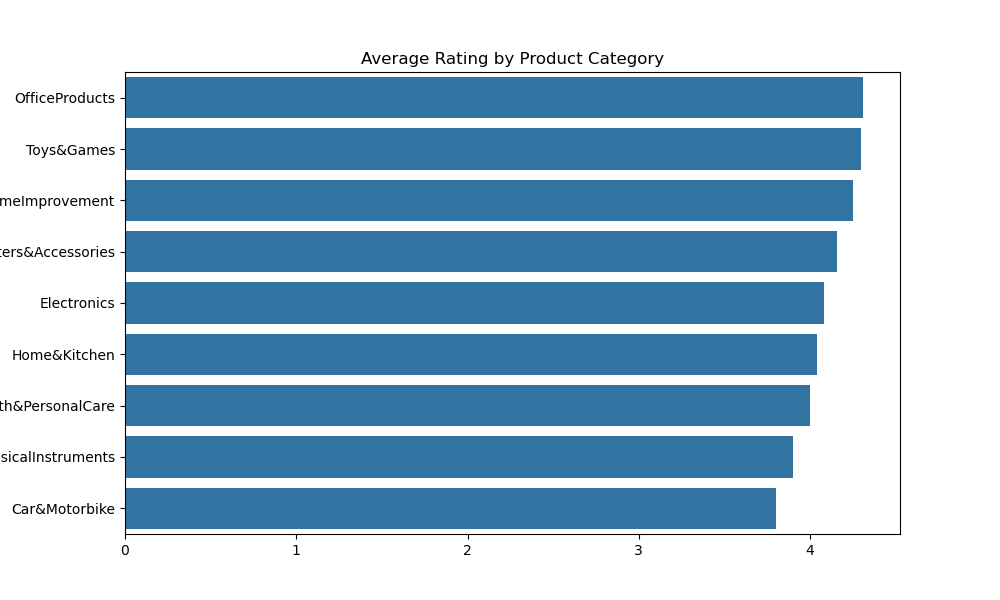
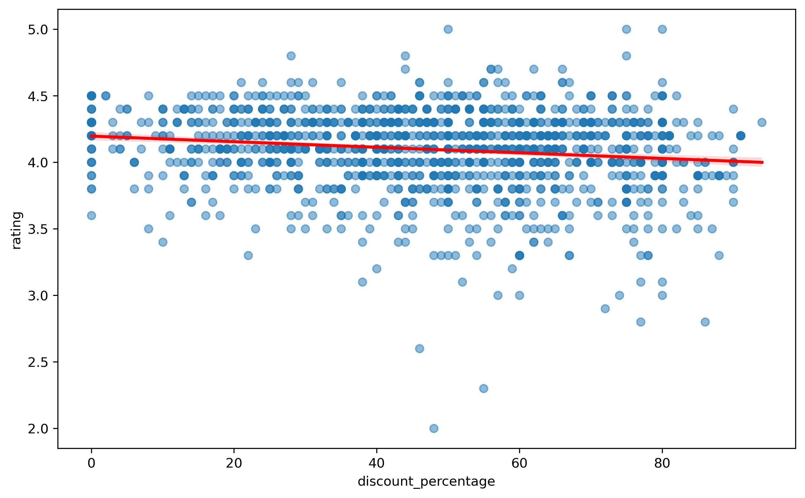

# amazon-discount-trap-analysis
Investigating the statistical relationship between discounts and product quality on Amazon India using a little of Python

# Unmasking the "Discount Trap" on Amazon India

## Project Overview
Is a 90% discount a great deal or a warning sign? This project analyzes over 1,000 products to find the correlation between price cuts and customer satisfaction.

## Key Insights
* **The Correlation:** Found a negative correlation of **-0.1554**. 
* **The Villain:** The "Discount Trap" is strongest in **Office Products** and **Electronics**.
* **Text Analysis:** Word clouds revealed that high-discount products often suffer from "poor build quality."

## Visualizations

## Tools Used
- Python (Pandas, Seaborn, Matplotlib, WordCloud)
- Jupyter Notebook
